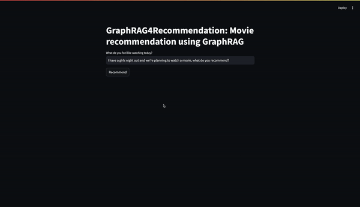
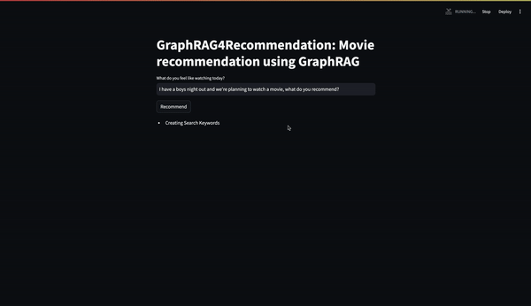
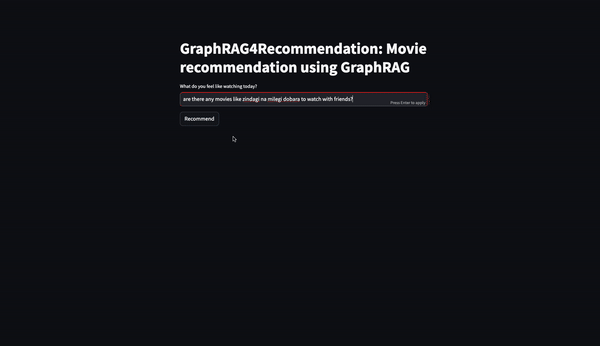

# GraphRAG4Rec

GraphRAG for a movie recommendation system using OpenAI LLMs.

This repository contains a naive implementation of **Microsoft's** _GraphRAG_ paper - [_From Local to Global: A Graph RAG Approach to Query-Focused Summarization_](https://arxiv.org/abs/2404.16130).

>**Note**: The implementation doesn't entrirely copy everything that's described in the paper or their [code repository](https://github.com/microsoft/graphrag).

This implementation borrows inspiration (mostly prompts) from the paper and the [graphrag](https://github.com/microsoft/graphrag) codebase and applies it in the field of recommendation systems.

This is more like "**Graph-Enhanced Content-Based Recommendation System with RAG Capabilities**."

## Project Setup

### Clone the Repository

```sh
git clone https://github.com/vatsalsaglani/GraphRAG4Rec.git
```

### Navigate to the Project Directory

```sh
cd GraphRAG4Rec
```

### Install Poetry

This project uses **Poetry** for _dependency management_. If you don't have Poetry installed please follow [this documentation](https://python-poetry.org/docs/).

### Install Project Dependencies

```sh
poetry install
```

### Add OpenAI API Key to environment
Create a `.env` file and add your OpenAI API key.

```.env
OPENAI_API_KEY="YOUR_OPEN_API_KEY"
```

### Create Community Graph
This project comes with the _IMDB Top 1000 Movies_ dataset source from [Kaggle](https://www.kaggle.com/datasets/harshitshankhdhar/imdb-dataset-of-top-1000-movies-and-tv-shows).

Using this dataset we will create the graph and detect communities.

Run the following command.

```sh
poetry run python -m graphragrec.graph.graph
```

This command will run the `graph` module which will do the following,

1. Extract Entities
2. Create Relations
3. Extract Claims from Entities + Relations
4. Builds and Visualizes the Graph
5. Detects Communities and Visualizes those
6. Also saves the graph data (entities, relations, claims), graph, and the communities.

It will create a folder `src/output/v7-all` where it will save everything.

To see the graph and the communities a live-server using the VSCode Live-Server extension.

The following is how the graph with communities will look like.


There are 100 communities in total with a lot of nodes and relations. Hence, it might take time to load as well.

>**Note**: We're using `gpt-3.5-turbo-0125` for these tasks and it can take an hour to fetch entities, relations, and claims for every movies. After which the graphs will be built. It will cost around $3 to $5.


### Create Community Summary Reports

Once the community graph is created we need to create summary reports for each community which will contain high-level information about what that community represents.

>**Note**: From here on, run all the commands from inside the `src` folder
> ```sh
> cd src/

To do this run the following command.

```sh
poetry run python -m graphragrec.graph.communities
```

This command will fetch the graph and community stored in the last step at `src/output/v7-all` and use that to summarize the communities and create reports. 

The communities with summary reports will be stored at `src/output/v7-all/community-reports.json`.

>**Note**: We're using `gpt-3.5-turbo-0125` for these tasks and it can take 30 to 40 minutes to summarize the communities.It will cost around $4 to $6.

### Naive Community Batching

To generate a response for a user query we need to pass that query to all the communities (worst case) which can be time taking because of multiple calls and expensive.

To avoid that we'll batch communities based on token lengths and max batch size to be $8$.

To batch run the following command.

```sh
poetry run python -m graphragrec.utils.helpers.batch_community_reports
```

This command will run the `batch_community_report` module which will take the community reports from the `src/output/v7-all/community-reports.json` file and batch those programatically.

There are a lot of ways communities can be batched. One such was is during detection we find levels in the community hierarchy.

We're using the Leiden algorithm (as mentioned in the paper) to detect communities. After detection we can get the levels and batch communities as well.

In this codebase, a naive approach of batching is implemented. In total we'll have $13$ to $15$ batches.

The batches will be stored at `src/output.v7-all/batched-community-reports.json`.


### Start the Streamlit Application

The codebase contains a Streamlit application via which we can get recommendation.

Use the following command to run the Streamlit application.

```sh
poetry run streamlit run streamlit.py
```

This will start the Streamlit application client and expose it on a port on your system and redirect you to a browser.

Enter the message in the input and get recommendation.

>**Head's Up**: For recommendation we use the **GPT-4o** model. In every recommendation we'll have around $90,000$ to $102,000$ input tokens (cummulative) and $8,000$ to $10,000$ output tokens (cummulative). Hence, recommendations are a costly affair.

## Output

The following is how the recommendations will look like.

### Query 1: _I'm feeling low recommend a movie_


### Query 2: _Movie for a girl's night out_


### Query 3: _Movie for a boy's night out_


### Query 4: _Movie like {some other movie name}_


